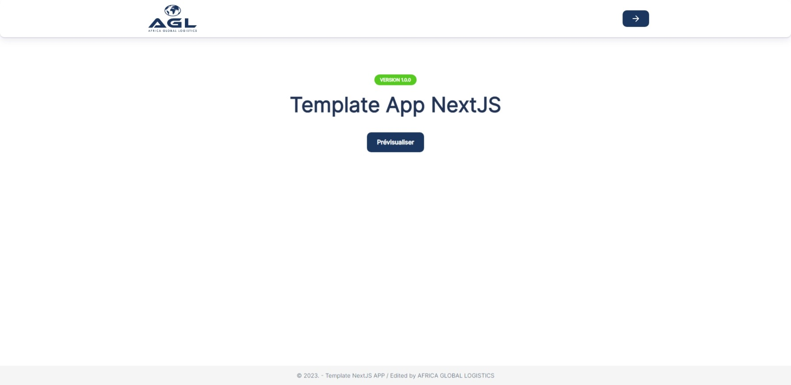
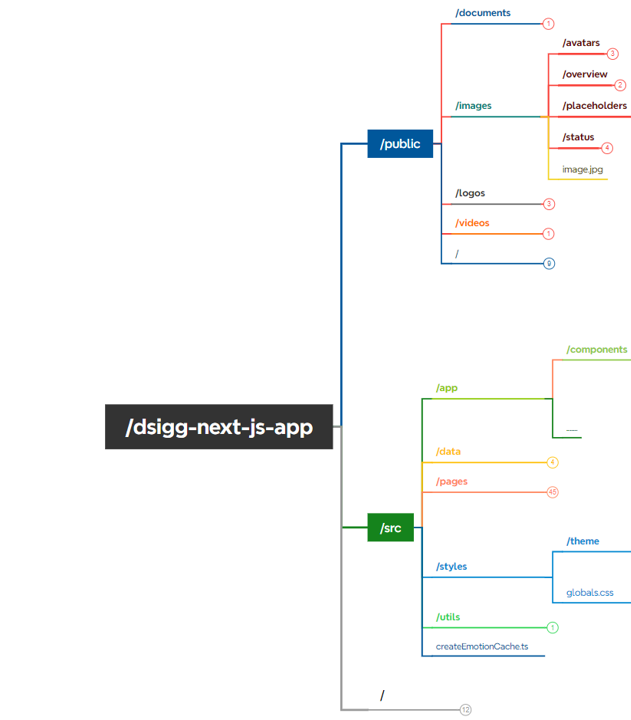
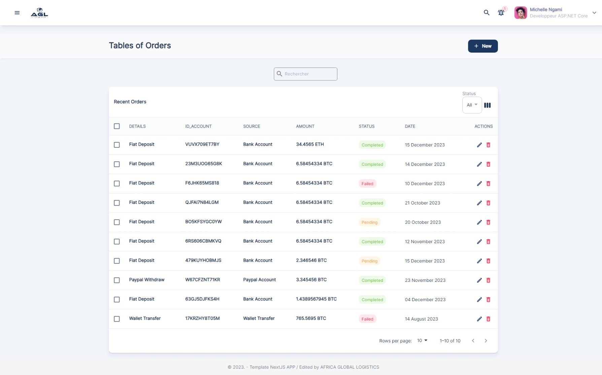

# Template APP NextJS

- Hello, Welcome !
- This is the NextJS Template (project 0) for our application developments ;
- It's from this template that we'll build our next development projects ;
## Technologies
 - NextJS ;
 - React ;
 - Material UI;
 - TypeScript ;
## Menu 
- Horizontal Menu
- Vertical Menu
- Scroll Menu
## Components
- Buttons ;
- Forms ;
- Cards ;
- Tabs ;
- PopUp
- etc ....
## Arborscence du dossier projet

- /
  - /public
    - /documents
    - /images
    - /logos
    - /videos
    - favicon.ico
    - ......
  - src
    - /app
      - /components
        - /pages
        - /shared
          - /.....
        - /skeletons
        - /widgets
          - /contexts
          - /layouts
            - /BaseLayout
            - /MENU
            - /SidebarLayout
              - /Header
              - /Sidebar
            - index.tsx
    - /data
    - /pages
    - /styles
      - /theme
      - ...
    - /utils
    - createEmotionCache
## Interfaces
- Home Page

-Menu

## Quick Start
- Make sure you have the latest stable versions for Node.js and NPM installed
- Clone repository: <code>git clone https://agl-dev@dev.azure.com/agl-dev/DSI-AGLGG/_git/AZR_DSIGG_NEXT_JS_APP_Clean</code>
- Install dependencies: Run <code>npm install</code> inside the project folder</li>
- Start dev server: After the install finishes, run <code>yarn dev</code>. A browser window will open on http://localhost:3000 where you''ll see the live preview

## Licence
Propriétaire : [DSI AGL GOLFE DE GUINEE](https://dev.azure.com/agl-dev/DSI-AGLGG/)
